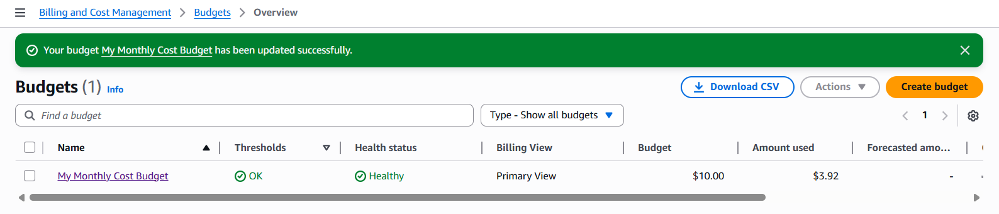

# AWS Cost Budgets — Monitoramento e Controle de Gastos

## Contexto

Em ambientes cloud, o controle de custos é um componente essencial da governança financeira (FinOps).  
Sem mecanismos de monitoramento adequados, o uso de recursos pode crescer rapidamente e gerar custos inesperados.

O serviço **AWS Budgets** permite definir limites de gastos e configurar alertas automáticos quando determinados thresholds são atingidos.  
Isso fornece visibilidade sobre o consumo da infraestrutura e permite ações preventivas para evitar desvios de orçamento.

Neste projeto, foi implementado um **Cost Budget mensal**, com alertas configurados para diferentes níveis de consumo, permitindo monitoramento contínuo dos gastos da conta AWS.

# Objetivo do projeto

Implementar um **AWS Cost Budget** para monitorar os gastos da conta e receber notificações quando determinados limites de custo forem atingidos.

Esse mecanismo permite maior **governança financeira e visibilidade de custos** em ambientes cloud.

---

# Arquitetura

AWS Billing → AWS Budgets → Notificação (Email / SNS)

O serviço **AWS Budgets** monitora continuamente os gastos da conta e envia alertas quando os limites configurados são ultrapassados.

---

# Implementação

## 1. Criar um orçamento de custo

No console AWS:

```Billing → Budgets → Create budget```

Configuração utilizada:

Tipo de orçamento:

```Cost budget```


Período:

```My Monthly Cost Budget```


Valor de exemplo: $10


---

## 2. Configurar alertas de orçamento

Foram configurados alertas baseados em percentual de consumo.

| Threshold | Tipo |
|------|------|
| 50% | Alert |
| 80% | Alert |
| 100% | Alert |

Quando esses limites são atingidos, uma notificação é enviada.

---

# Validação

O orçamento pode ser visualizado em:

```Billing → Budgets```


Estado esperado:

```OK```


Os alertas são enviados quando o consumo ultrapassa os thresholds definidos.

---

# Perguntas técnicas

### 1. Para que usuários IAM possam criar budgets, que permissões adicionais são necessárias?

Os usuários IAM precisam ter permissões para acessar o serviço **AWS Billing and Cost Management**.

Permissões necessárias:

- `budgets:CreateBudget`
- `budgets:ViewBudget`
- `billing:ViewBilling`

Essas permissões normalmente fazem parte das políticas:

- `AWSBillingReadOnlyAccess`
- `AWSBudgetsActionsPolicy`

---

### 2. Além do console, como os budgets podem ser criados?

Budgets também podem ser criados utilizando:

- **AWS CLI**
- **AWS SDKs** (Python, Java, etc.)
- **AWS CloudFormation**
- **AWS Budgets API**

Isso permite automação e integração com práticas de **Infrastructure as Code (IaC)**.

---

### 3. É melhor criar budgets recorrentes ou temporários?

Budgets recorrentes são mais recomendados, pois permitem monitoramento contínuo dos gastos e ajudam a manter controle financeiro de longo prazo.

Eles fornecem visibilidade sobre tendências de consumo e permitem ajustes proativos no uso da infraestrutura.

---

### 4. Quais tipos de budgets existem na AWS?

A AWS permite diferentes tipos de budgets:

**Cost Budgets**

Planejam quanto se pretende gastar em serviços AWS.

**Usage Budgets**

Monitoram o uso de recursos específicos.

**RI Utilization Budgets**

Monitoram a utilização de Reserved Instances.

**RI Coverage Budgets**

Monitoram a cobertura de Reserved Instances sobre o uso de instâncias.

**Savings Plans Utilization Budgets**

Monitoram a utilização de Savings Plans.

**Savings Plans Coverage Budgets**

Monitoram quanto do uso elegível está coberto por Savings Plans.

---

### 5. Quais opções existem para alertas de budgets?

AWS Budgets permite diferentes tipos de alertas:

**Threshold alerts**

Alertas quando o custo ultrapassa determinado percentual.

**Usage alerts**

Alertas baseados em uso de recursos.

**Cost type alerts**

Alertas baseados em tipos específicos de custo.

**Notification channels**

Alertas podem ser enviados via:

- email
- SNS
- SMS
- integrações automatizadas

---

# Referências

Documentação oficial AWS:

* [Sobre criar budget](https://docs.aws.amazon.com/awsaccountbilling/latest/aboutv2/budgets-create.html)

* [Boas práticas](https://docs.aws.amazon.com/awsaccountbilling/latest/aboutv2/budgets-best-practices.html)

---

# Custos

Este projeto está incluído no **AWS Free Tier**.

---

# Evidências

Os prints da configuração estão disponíveis na pasta



